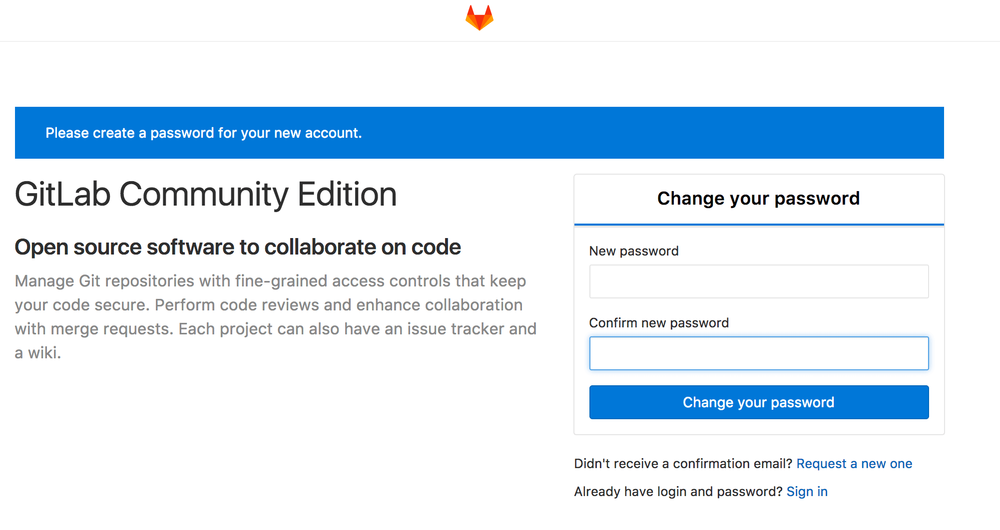

>  GitLab是利用 Ruby on Rails 的一个开源的版本管理系统，实现一个自托管的Git项目仓库，可通过Web界面进行访问公开的或者私人项目。它拥有与Github类似的功能，能够浏览源代码，管理缺陷和注释。可以管理团队对仓库的访问，它非常易于浏览提交过的版本并提供一个文件历史库。团队成员可以利用内置的简单聊天程序(Wall)进行交流。它还提供一个代码片段收集功能可以轻松实现代码复用，便于日后有需要的时候进行查找

### 配置要求

RAM 4G+

### 依赖组件

根据官方文档说明有以下依赖，但实际中发现部分无需安装也可以.

1. Packages / Dependencies
2. Ruby
3. Go
4. Node
5. System Users
6. database
7. Redis
8. GitLab
9. Nginx
10. Git(2.8.4 or higher)

### 安装方式

安装方式有两种:Omnibus包安装和编译安装。

#### 一、Omnibus包安装（安装起来更快、更容易升级版本，而且包含了其他安装方式所没有的可靠性功能）

1.安装Packages / Dependencies
    
    [root@centos ~]# yum -y update
    
2.安装Ruby

Ruby安装有四种方式:

- 系统包管理工具(yum、apg-get等),简单快速,但是一般不是最新的版本
- 安装工具
- 第三方管理工具,RVM等
- 编译方式

因为我要安装ruby2.4,yum库中只能安装ruby2.0,所以我选择了编译安装
    

    [root@centos ~]# ruby -v
    bash: ruby: command not found...
    [root@centos ~]# curl -O https://cache.ruby-lang.org/pub/ruby/2.4/ruby-2.4.1.tar.gz
    [root@centos ~]# tar -zxvf ruby-2.4.1.tar.gz
    [root@centos ~]# cd ruby-2.4.1/
    [root@centos ~]# ./configure
    [root@centos ~]# make && make install
    
添加环境变量

    [root@centos ~]# vim ~/.bash_profile
        RUBY_ROOT=/usr/local/lib/ruby
        RUBY=$RUBY_ROOT/2.4.0
        GEM=$RUBY_ROOT/gem
        export PATH=$PATH:$RUBY:$GEM
    [root@centos ~]# source ~/.bash_profile
    [root@centos ~]# ruby -v
     ruby 2.4.1p111 (2017-03-22 revision 58053) [x86_64-linux]
    [root@centos ~]# gem --version
     2.6.11
     
    
3.System Users
 添加gitlab用户     
    
    [root@centos ~]# adduser --system --shell /bin/bash --comment 'GitLab' --create-home --home-dir /home/gitlab gitlab

4.安装PostgreSQL

    [root@centos ~]# yum install -y https://download.postgresql.org/pub/repos/yum/9.6/redhat/rhel-7-x86_64/pgdg-centos96-9.6-3.noarch.rpm
    [root@centos ~]# yum install -y postgresql96 postgresql96-server postgresql96-contrib 
    [root@centos ~]# vim ~/.bash_profile
        POSTGRESQL=/usr/pgsql-9.6
        LD_LIBRARY_PATH=$POSTGRESQL/lib
        PGDATA=/var/lib/pgsql/9.6/data
        export PATH=$PATH:$POSTGRESQL/bin:$PGDATA:$LD_LIBRARY_PATH
    [root@centos ~]# source ~/.bash_profile
    [root@centos ~]# systemctl enable postgresql-9.6
    
  
设置密码登录

    [root@centos ~]# vim /var/lib/pgsql/9.6/data/pg_hba.conf
        #host    all             all             127.0.0.1/32            ident
        #改为
        #host    all             all             127.0.0.1/32            md5
    
初始化

    [root@centos ~]# /usr/pgsql-9.6/bin/postgresql96-setup initdb

启动

    [root@centos ~]# systemctl start postgresql-9.6
    
启动服务:
    
    [root@centos ~]# systemctl start postgresql-9.6
    
重启服务

    [root@centos ~]# systemctl restart postgresql-9.6

停止服务

    [root@centos ~]# systemctl stop postgresql-9.6

自动启动

    [root@centos ~]# systemctl enable postgresql-9.6

postgresql96:客户端  
ostgresql96-server:服务端  
postgresql96-contrib:常用的组件和方法  
切换至postgres用户
    
    [root@centos ~]# su - postgres 
    #(或su postgres)
    #切换用户，执行后提示符会变为 '-bash-4.2$'
    bash-4.2$ psql --version
     psql (PostgreSQL) 9.6.4

登录数据库，执行后提示符变为 'postgres=#'
  
    bash-4.2$ psql -U postgres
    #设置postgres用户密码
    postgres=# ALTER USER postgres WITH PASSWORD '123456';
    #创建gitlab用户
    postgres=# CREATE USER gitlab SUPERUSER PASSWORD 'gitlab';
    #查看现有用户
    postgres=# \du
    postgres-# CREATE DATABASE gitlabhq_production;
     CREATE DATABASE
    #退出数据库
    postgres=# \q

在root用户下登录:
    
    [root@centos ~]# sudo psql -U gitlab -h 127.0.0.1 -d gitlabhq_production
     gitlabhq_production=#

5.安装Git

    [root@centos ~]# yum -y install git
    
6.安装Gitlab

①.如果你想使用 Postfix 发送邮件，请在安装过程中根据提示选择 'Internet Site'。 你也可以用 Sendmail 或者 配置一个自定义的 SMTP 服务 并 把它作为一个 SMTP 服务器。

在 CentOS 系统上，下面的命令将会打开系统防火墙 HTTP 和 SSH 的访问。

    sudo yum install curl policycoreutils openssh-server openssh-clients
    sudo systemctl enable sshd
    sudo systemctl start sshd
    sudo yum install postfix
    sudo systemctl enable postfix
    sudo systemctl start postfix
    sudo firewall-cmd --permanent --add-service=http
    sudo systemctl reload firewalld
    
②.添加 GitLab 镜像源并安装

    [root@centos ~]# curl -sS https://packages.gitlab.com/install/repositories/gitlab/gitlab-ce/script.rpm.sh | sudo bash
    [root@centos ~]# sudo yum install -y gitlab-ce
    #修改配置
    [root@centos ~]# vim /etc/gitlab/gitlab.rb
   
    
③.需要修改的配置
    
    #13 项目中显示的gitlab地址
    external_url 'http://gitlab.example.com'

    #363 使用非集成的postgresql
    gitlab_rails['db_adapter'] = "postgresql"
    gitlab_rails['db_encoding'] = "utf8"
    #gitlab_rails['db_encoding'] = "unicode
    #gitlab_rails['db_collation'] = nil
    # gitlab_rails['db_database'] = "gitlabhq_production"
    # gitlab_rails['db_pool'] = 10
    gitlab_rails['db_username'] = "gitlab"
    gitlab_rails['db_password'] = "123456"
    gitlab_rails['db_host'] = '127.0.0.1'
    gitlab_rails['db_port'] = '5432'
    
    #384 使用非集成的redis
    gitlab_rails['redis_host'] = "127.0.0.1"
    gitlab_rails['redis_port'] = 6379
    gitlab_rails['redis_password'] = "123456"
    gitlab_rails['redis_database'] = 1
    
    #561 设置unicorn监听端口
    unicorn['listen'] = '127.0.0.1'
    unicorn['port'] = 8087
    
    #619 是否使用集成postgresql
    postgresql['enable'] = false
    
    #721 是否使用集成redis
    redis['enable'] = false
    
    #788 是否使用集成nginx,即使本地安装了Nginx也建议打开集成的nginx
    nginx['enable'] = true
    
    #827 集成的Nginx监听的端口,若要本地和集成的Nginx同时使用,则更改监听端口
    nginx['listen_port'] = 80
    #nginx['listen_port'] = 8088

④.使配置生效

    [root@centos ~]# sudo gitlab-ctl reconfigure
    #启动gitlab
    [root@centos ~]# gitlab-ctl start
    #重启
    [root@centos ~]# gitlab-ctl restart
    #停止
    [root@centos ~]# gitlab-ctl stop

#### 二、编译安装(待补充)

#### 安装成功

安装成功之后,访问域名或者ip,会提示更改root用户密码

随后跳转登录,用户名为root

#### 参考文献

http://www.cnblogs.com/wintersun/p/3930900.html
https://gitlab.com/gitlab-org/gitlab-ce/blob/master/doc/install/installation.md
* 其他搜索未记录